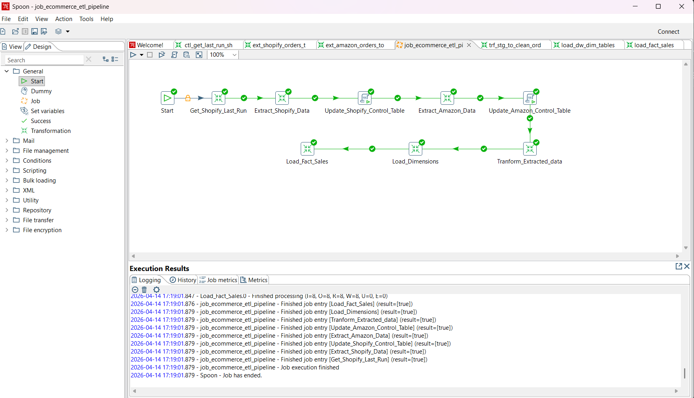

# E-Commerce ETL Pipeline with QA Validation

## Overview

End-to-end ETL pipeline integrating **Shopify (DB)** and **Amazon (CSV)** data, with a strong focus on **data quality validation using STLC (Software Testing Life Cycle)**.


---

## Architecture

**Flow:**
Source → Staging → Clean Layer → Data Warehouse

---

## QA Focus

This project emphasizes **ETL testing**, including:

* Requirement analysis
* Test scenarios & test cases
* Data validation using SQL
* Defect logging & tracking
* End-to-end test execution

See full QA artifacts in `qa/`

---

## Repository Structure

```plaintext
qa/             → Test cases, execution, defects, RTM  
etl_design/     → ETL transformation logic  
architecture/   → Data model & flow  
validation/     → Validation queries  
images/         → Design and execution Screenshots   
```

---

### ETL Job Workflow



---

## Highlights

* Multi-source ETL pipeline
* Incremental data processing
* Data cleansing & deduplication
* Star schema data warehouse
* Realistic ETL defect simulation

---

## Note

ETL `.ktr/.kjb` files are not included.
This repository focuses on **design, validation, and QA perspective**.

---

## Author

Harikrishnaveni
