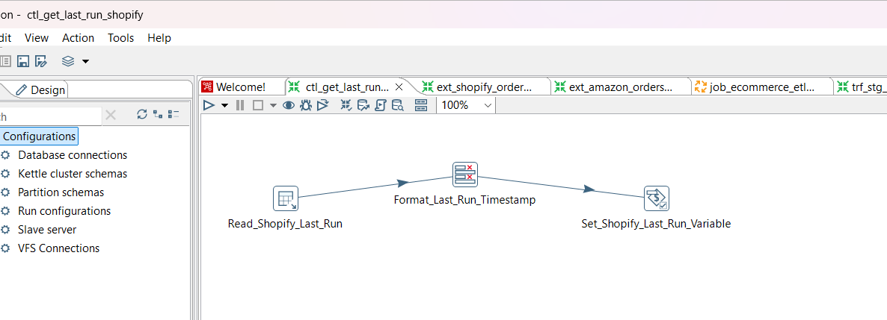
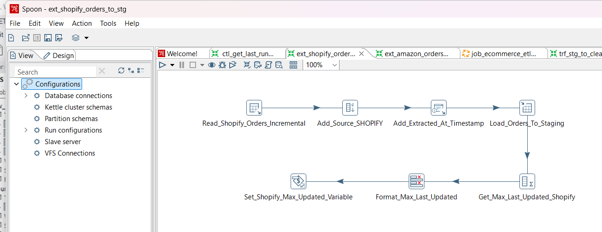

# ETL Transformations Design

## Overview

This document describes the logical design of ETL transformations implemented using Pentaho Data Integration (Spoon).

---

## 1. get_last_run

- Reads `last_run_time` from `etl_control`
- Sets variable:
  - `LAST_SHOPIFY_RUN`
 

---

## 2. extract_shopify_data

- Extracts records:
  WHERE last_updated > ${LAST_SHOPIFY_RUN}

- Adds:
  - source = 'SHOPIFY'
  - extracted_at (system timestamp)

- Loads into:
  - staging_orders

- Captures:
  - max(last_updated)

---

## 3. extract_amazon_data

- Reads CSV input
- Standardizes data types
- Adds:
  - source = 'AMAZON'
  - extracted_at

- Loads using:
  - Insert/Update into staging_orders

---

## 4. clean_staging_data

- Standardizes schema
- Cleans text fields:
  - trim, casing

- Calculates:
  - total_price = quantity × price

### Validation Rules:
- quantity > 0
- price > 0
- order_id NOT NULL

### Invalid Records:
- Loaded into:
  - etl_error_orders

### Valid Records:
- Sorted by:
  - order_id, source, last_updated DESC
- Deduplicated (latest record retained)
- Loaded into:
  - stg_clean_orders

---

## 5. load_dw_tables

### Product Dimension:
- Extract unique products
- Load into dim_product

### Customer Dimension:
- Handle nulls:
  - customer_id = -1
  - email = 'UNKNOWN'
- Load into dim_customer

---

## 6. load_fact_sales

- Lookup:
  - product_key
  - customer_key

### Valid Records:
- Loaded into fact_sales

### Invalid Records:
- Missing keys
- Logged into:
  - etl_error_orders
 

## Sample Transformation

