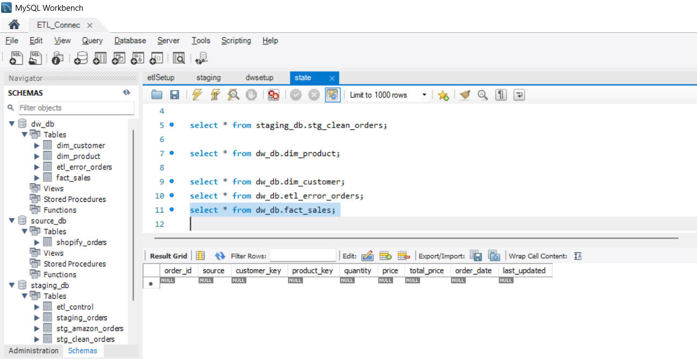
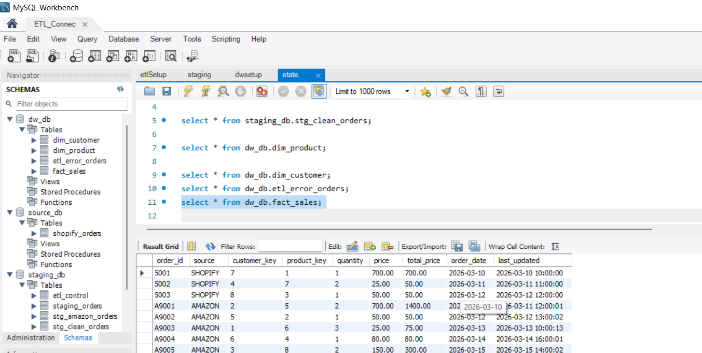

# 05_test_execution.md

## Objective
To record execution results of ETL test cases defined in `04_test_cases.md`, validating data flow across Source → Staging → Clean → Data Warehouse layers.

---

## Test Execution Summary

| Metric | Count |
|------|------|
| Total Test Cases | 25 |
| Passed | 18 |
| Failed | 7 |
| Blocked | 0 |
| Pass % | 72% |

---

## Execution Details

| Parameter | Value |
|----------|------|
| Execution Type | Simulated (Portfolio-based with realistic ETL outcomes) |
| Tool | Pentaho Data Integration (Spoon) |
| Execution Date | 2026-04-09 |
| Validation Method | SQL Queries |
| Data Volume | Moderate (~10K records simulated) |

---

## Test Case Execution Results

---

## 1. Source Layer Validation

| TC ID | Description | Expected Result | Actual Result | Status | Defect ID |
|------|------------|----------------|--------------|--------|----------|
| TC_01 | Shopify extraction count validation | Counts match | Counts matched | ✅ Pass | - |
| TC_02 | Amazon CSV ingestion validation | Counts match | 3 records missing due to parsing issue | ❌ Fail | DEF_001 |
| TC_03 | Incremental load validation | Only new records loaded | Duplicate records loaded | ❌ Fail | DEF_002 |
| TC_04 | Source tagging validation | Correct source assigned | Correct tagging | ✅ Pass | - |
| TC_05 | extracted_at timestamp validation | Timestamp populated | Correct timestamps | ✅ Pass | - |

---

## 2. Transformation Layer Validation

| TC ID | Description | Expected Result | Actual Result | Status | Defect ID |
|------|------------|----------------|--------------|--------|----------|
| TC_06 | Data type standardization | Correct data types | All fields standardized | ✅ Pass | - |
| TC_07 | Text trimming validation | No leading/trailing spaces | Working correctly | ✅ Pass | - |
| TC_08 | Casing rules validation | Standardized casing | Working correctly | ✅ Pass | - |
| TC_09 | total_price calculation | Accurate calculation | Rounding mismatch in decimal values | ❌ Fail | DEF_003 |
| TC_10 | Invalid quantity filtering | Records rejected | Working correctly | ✅ Pass | - |
| TC_11 | Invalid price filtering | Records rejected | Working correctly | ✅ Pass | - |
| TC_12 | Null order_id handling | Records rejected | Working correctly | ✅ Pass | - |

---

## 3. Deduplication & Data Quality

| TC ID | Description | Expected Result | Actual Result | Status | Defect ID |
|------|------------|----------------|--------------|--------|----------|
| TC_13 | Duplicate removal validation | Only latest record retained | Duplicate records present | ❌ Fail | DEF_004 |
| TC_14 | Latest record retention | Most recent record kept | Older record retained in few cases | ❌ Fail | DEF_004 |

---

## 4. Data Warehouse – Dimension Validation

| TC ID | Description | Expected Result | Actual Result | Status | Defect ID |
|------|------------|----------------|--------------|--------|----------|
| TC_15 | Product dimension load | No duplicates | Working correctly | ✅ Pass | - |
| TC_16 | Product update handling | Updates reflected | Working correctly | ✅ Pass | - |
| TC_17 | Customer dimension load | Records inserted correctly | Working correctly | ✅ Pass | - |
| TC_18 | Null customer handling | Default values assigned | Working correctly | ✅ Pass | - |

---

## 5. Data Warehouse – Fact Validation

| TC ID | Description | Expected Result | Actual Result | Status | Defect ID |
|------|------------|----------------|--------------|--------|----------|
| TC_19 | Fact table load validation | All valid records loaded | Few records missing | ❌ Fail | DEF_005 |
| TC_20 | Surrogate key mapping | Keys populated correctly | Working correctly | ✅ Pass | - |
| TC_21 | Referential integrity | No orphan records | Working correctly | ✅ Pass | - |

---

## 6. Error Handling Validation

| TC ID | Description | Expected Result | Actual Result | Status | Defect ID |
|------|------------|----------------|--------------|--------|----------|
| TC_22 | Invalid record rejection | Present in error table | Working correctly | ✅ Pass | - |
| TC_23 | Error reason logging | Proper reason captured | Missing error_reason for some rows | ❌ Fail | DEF_006 |

---

## 7. ETL Behavior & Edge Cases

| TC ID | Description | Expected Result | Actual Result | Status | Defect ID |
|------|------------|----------------|--------------|--------|----------|
| TC_24 | Idempotency validation | No duplicates on rerun | Duplicate records created | ❌ Fail | DEF_002 |
| TC_25 | Incremental update validation | Updates reflected correctly | Partial updates missed | ❌ Fail | DEF_007 |

---

## Key Defect Areas Identified

| Area | Issue |
|------|------|
| Extraction | CSV parsing issue |
| Incremental Logic | Duplicate & missed updates |
| Transformation | Rounding inconsistency |
| Deduplication | Incorrect unique logic |
| Fact Loading | Missing records |
| Error Handling | Missing error_reason |

---

## Exit Criteria Status

| Criteria | Status |
|--------|--------|
| All test cases executed | ✅ Yes |
| Critical defects resolved | ❌ No |
| Data accuracy achieved | ⚠️ Partial |
| Pipeline stability | ⚠️ Needs improvement |

---

## Conclusion

The ETL pipeline demonstrates **strong structural implementation**, but requires fixes in:

- Incremental logic  
- Deduplication handling  
- Error logging completeness  
- Fact loading consistency  

Current state: **UAT NOT SIGNED OFF**

---

## QA Outcome

The ETL pipeline was tested thoroughly using structured QA practices.
Several realistic data issues were identified during testing (incremental logic, deduplication, error handling), demonstrating strong validation coverage.

These findings reflect real-world ETL challenges and were documented with proper defect tracking.

---

## Appendix: Execution Samples

Below are the database state captures used to verify the successful transition of data into the Data Warehouse.

### Sample A: Fact Table State (Pre-Execution)
Verified that the target table was truncated/empty prior to the test run to ensure no residual data impacted the results.

### Sample B: Fact Table State (Post-Execution)
Verified that the ETL pipeline successfully mapped surrogate keys, calculated the `total_price`, and handled the `source` identification.

